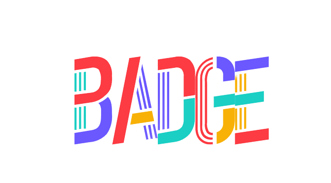

    

 Welcome to OnlyBadge!

## Demo 

## Project Introduction
OnlyBadge wants to help more real-world enterprises better enter the blockchain world through the features of nft, as a bridge between the two, so that real-world enterprises can have more development in the blockchain world Chance. The inspiration for creating this project mainly comes from the current web3 products: Project Galaxy, POAP and some current traditional social media platforms.

## The project wants to solve the problem of centralization of traffic exposure
For example, traditional companies need to pay high fees in order to gain exposure to the platform, and they may not achieve the expected goals of the company in the end. At the same time, when companies want to promote their products or services through activities, they still need to spend a certain amount of money to find influential Internet celebrities to promote them.

## The nft in the blockchain can improve the current situation where the platform traffic distribution is too centralized. 
After completing the tasks released by the company, users can get badges released by the company, fusd stablecoins on the Flow chain and token rewards from the OnlyBadge platform. The specific process is as follows: if a company wants to increase its exposure, the first option can choose to pay additional Fusd and platform tokens to encourage users to participate in the event as a promotion reward; the second option is to pledge Fusd and OnlyBadge platform tokens. The token is used to form a liquidity pool, and after the pledge, the voting rights of the OnlyBadge platform can be obtained. The role of voting rights is to obtain the decision-making power of the platform to allocate exposure. At the same time, you can also get an nft with a pledge certificate. In the future, this nft can cooperate with other metaverse projects on the chain, and the airdrop reward can be used to build the web3 image of the enterprise.
---

